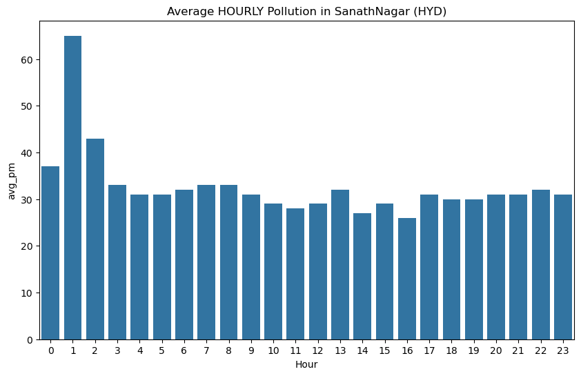
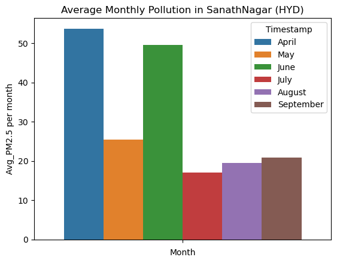
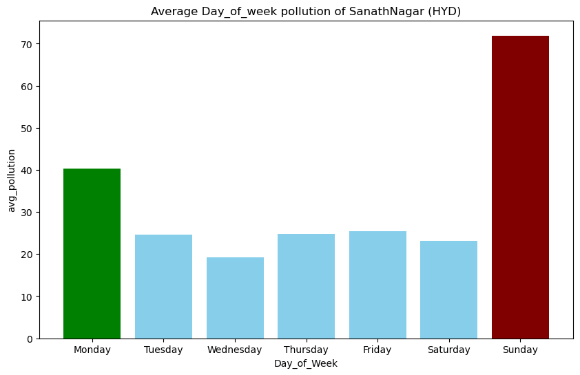
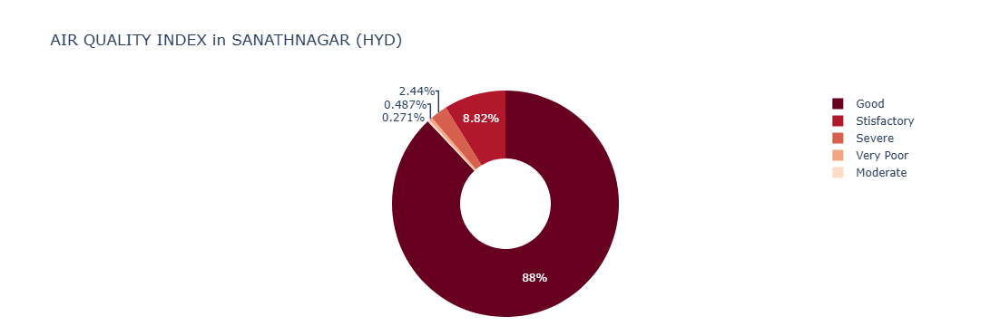

# 🏭 Deciphering the Smog: A Root Cause Analysis of Air Quality Anomalies in Sanathnagar, Hyderabad (2025)


## 📌 Project Overview
While general news reports often highlight winter as the peak pollution season in Hyderabad, local data for the **Sanathnagar** area indicated a contradictory trend: rising pollution levels even during summer months. 

This project performs a **Root Cause Analysis (RCA)** on real-world air quality data (April–September 2025) to understand these anomalies. By moving beyond aggregate city data and focusing on a specific monitoring station, this analysis uncovers specific events (festivals, weather phenomena) that drive pollution spikes.

## 📂 Data Source
* **Source:** Central Control Room for Air Quality Management - Delhi NCR (CPCB Government Portal).
* **Station:** Sanathnagar, Hyderabad.
* **Timeline:** April 2025 – September 2025 (6 Months).
* **Key Metric:** PM2.5 (µg/m³).

## 🛠️ Tech Stack & Methodology
* **Data Cleaning:** Handling missing values using **Time-based Interpolation**.
* **Feature Engineering:** * Extracted temporal features: `Hour`, `Month`, `Day_of_Week`.
    * Created `AQI_Category` based on PM2.5 concentration thresholds.
* **Visualization:** Matplotlib, Seaborn, and Plotly for interactive distribution charts.

## 📊 Key Analysis & Insights

### 1. Hourly Trends: When is the air safest?
**Observation:**
* **Peak Pollution:** 1:00 AM (Due to temperature inversion trapping pollutants and heavy vehicle movement at night).
* **Lowest Pollution:** 4:00 PM.
* **Rush Hour Effect:** Moderate spikes observed between 6:00 AM – 9:00 AM.

> **📉 Actionable Insight:** The safest time for outdoor activities in Sanathnagar is late afternoon (around 4:00 PM).

 


---

### 2. Monthly Analysis: The Monsoon Effect
**Observation:**
* **April:** High pollution due to summer heat accelerating chemical reactions and traffic emissions.
* **May:** Significant drop due to Pre-monsoon rains (Orange alert by IMD).
* **July - Sept:** Consistently low pollution due to the South-West Monsoon "Wash-out" effect.



---

### 3. Weekly Trends: The "Sunday Spike" Anomaly
Contrary to the expectation that weekdays (work days) would be more polluted, **Sunday** showed the highest average PM2.5 levels.

* **Sunday Avg:** ~72 µg/m³
* **Wednesday Avg:** ~19 µg/m³

*Why? See the Root Cause Analysis below.*




---

### 4. Overall Air Quality Distribution
Despite the spikes, the overall air quality in Sanathnagar for this period was largely acceptable.
* **Good/Satisfactory:** ~88% of the time.
* **Severe/Very Poor:** Occurred only during specific anomaly events.



## 🔍 Root Cause Analysis of Anomalies (The "Why")

The analysis flagged massive outliers where PM2.5 levels exceeded **500 µg/m³**. Using domain knowledge and historical weather/event data, these spikes were mapped to specific causes:

| Date | Event | PM2.5 Level | Root Cause |
| :--- | :--- | :--- | :--- |
| **April 13-14, 2025** | **Ambedkar Jayanti** | **591.00** | Massive processions, gatherings, and firecrackers associated with the festival celebrations caused a sharp, temporary spike. |
| **June 15, 2025** | **Dust Storm** | **548.34** | A severe pre-monsoon dust storm and squall passed through Hyderabad, raising particulate matter drastically before the monsoon onset. |

## 🏁 Conclusion
This analysis proves that while Sanathnagar has generally good air quality (88% of the time), it is highly susceptible to **event-based pollution** (festivals) and **weather phenomena** (dust storms, temperature inversion). 

Understanding these patterns allows for better personal planning—such as avoiding outdoor cardio at 1:00 AM or during festival evenings.

## 💻 How to Run This Project
1. Clone the repo:
   ```bash
    https://github.com/Rajula-Ravindhar/Deciphering-the-Smog-A-Root-Cause-Analysis-of-Air-Quality-Anomalies-in-Sanathnagar-Hyderabad-2025-.git
Install requirements:
```bash
pip install pandas numpy matplotlib seaborn plotly
Run the Jupyter Notebook:
```

```bash
jupyter notebook airPollution_prj.ipynb
```
Developer: [Ravindhar Rajula] Connect with me on [www.linkedin.com/in/rajularavindhar]
